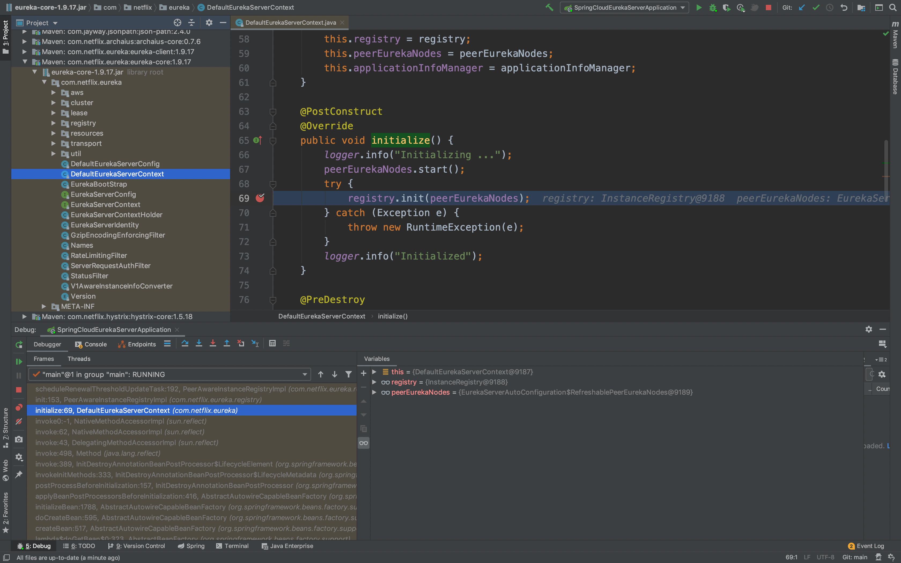

## eureka-server自我保护机制
### 每分钟最小的续约数量，即阈值
AbstractInstanceRegistry.updateRenewsPerMinThreshold()
```
protected void updateRenewsPerMinThreshold() {
    this.numberOfRenewsPerMinThreshold = (int) (this.expectedNumberOfClientsSendingRenews
            * (60.0 / serverConfig.getExpectedClientRenewalIntervalSeconds())
            * serverConfig.getRenewalPercentThreshold());
}
```
expectedNumberOfClientsSendingRenews   //服务总数

serverConfig.getExpectedClientRenewalIntervalSeconds()   //客户端续约的间隔时间，默认30s

serverConfig.getRenewalPercentThreshold()   //默认0.85

numberOfRenewsPerMinThreshold = (int)(5*(60/30)*0.85) = 8   //每分钟最小的续约数量

expectedNumberOfClientsSendingRenews有4个地方会更新这个值
- 1.AbstractInstanceRegistry.register()，服务注册

- 2.AbstractInstanceRegistry.internalCancel()，服务下线

- 3.PeerAwareInstanceRegistryImpl.openForTraffic()

- 4.PeerAwareInstanceRegistryImpl.updateRenewalThreshold()，定时任务


### eureka控制台和自我保护机制流程图
- 1.开启自我保护机制

- 2.不开启自我保护机制

- 3.自我保护机制流程图


### 自我保护机制代码详解
#### 服务启动
- 1.DefaultEurekaServerContext.initialize()，被@PostConstruct修饰的方法会在项目启动的时候执行

- 2.PeerAwareInstanceRegistryImpl.init()

- 3.PeerAwareInstanceRegistryImpl.scheduleRenewalThresholdUpdateTask()，计算续约阈值的定时任务，周期为15分钟

- 4.PeerAwareInstanceRegistryImpl.openForTraffic()

- 5.PeerAwareInstanceRegistryImpl.openForTraffic()

- 6.AbstractInstanceRegistry.postInit()，判断是否开启自我保护机制的定时任务，周期为1分钟

#### 计算续约阈值的定时任务
- 1.TimerTask.run()

- 2.PeerAwareInstanceRegistryImpl.updateRenewalThreshold()

- 3.AbstractInstanceRegistry.updateRenewsPerMinThreshold()，计算续约阈值，例如：(int)(5*(60/30)*0.85) = 8

#### 判断是否开启自我保护机制的定时任务
- 1.AbstractInstanceRegistry.EvictionTask.run()

- 2.AbstractInstanceRegistry.evict()

- 3.PeerAwareInstanceRegistryImpl.isLeaseExpirationEnabled()，getNumOfRenewsInLastMin()是最后一分钟收到的续约数量，numberOfRenewsPerMinThreshold是每分钟最小的续约数量，即阈值，当最后一分钟收到的续约数量小于阈值时，则开启自我保护机制

