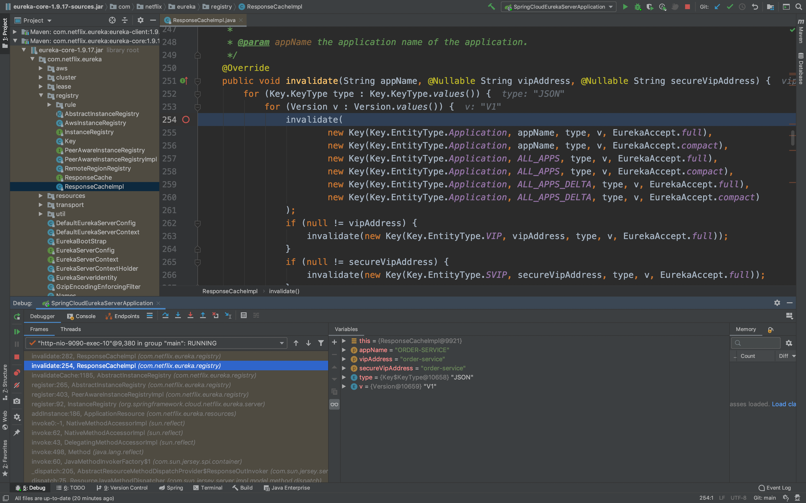

## eureka-server
### 服务注册
- 1.ApplicationResource.addInstance()

- 2.PeerAwareInstanceRegistryImpl.register()

- 3.AbstractInstanceRegistry.register()

- 4.AbstractInstanceRegistry.register()，服务注册保存到本地内存

- 5.AbstractInstanceRegistry.register()，清除缓存

- 6.AbstractInstanceRegistry.invalidateCache()

- 7.ResponseCacheImpl.invalidate()

- 8.ResponseCacheImpl.invalidate()，readWriteCacheMap用的是guava的LoadingCache

