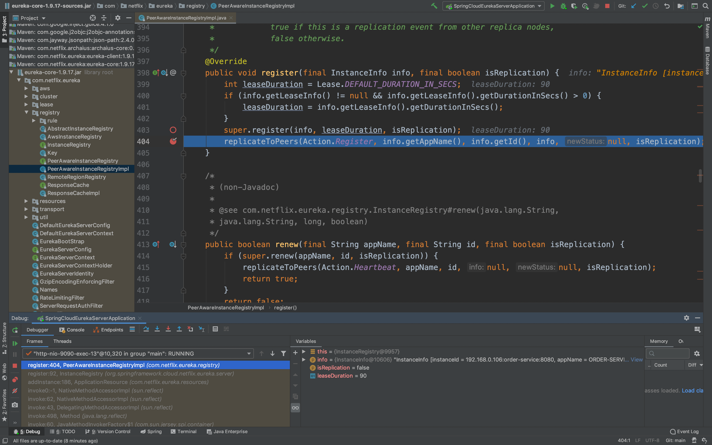
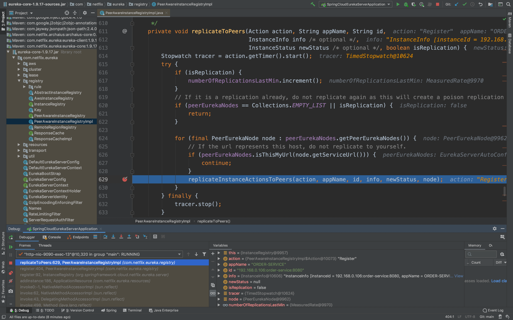
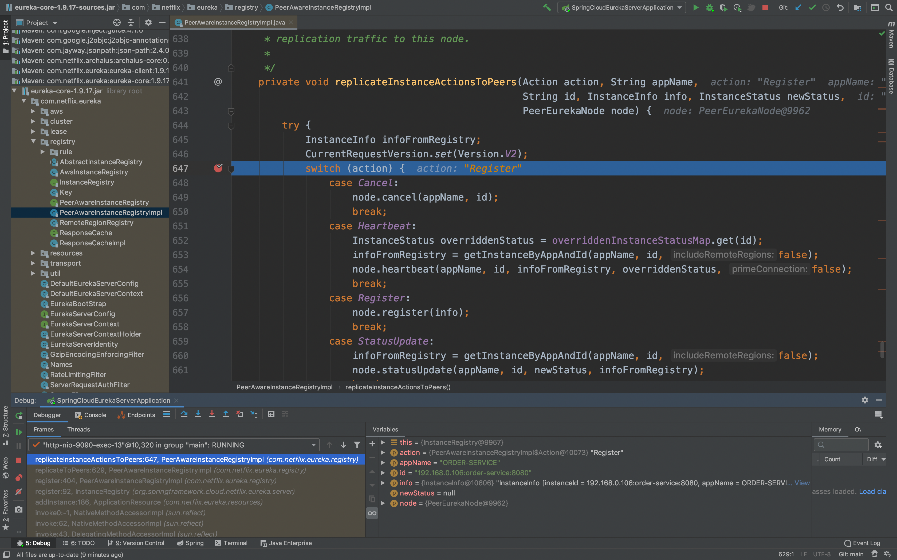
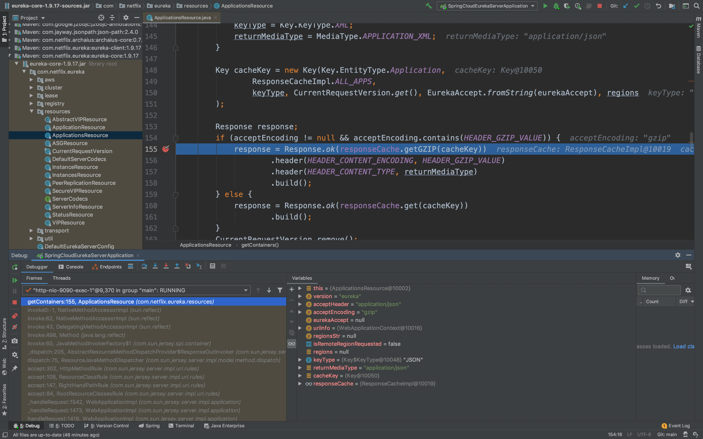
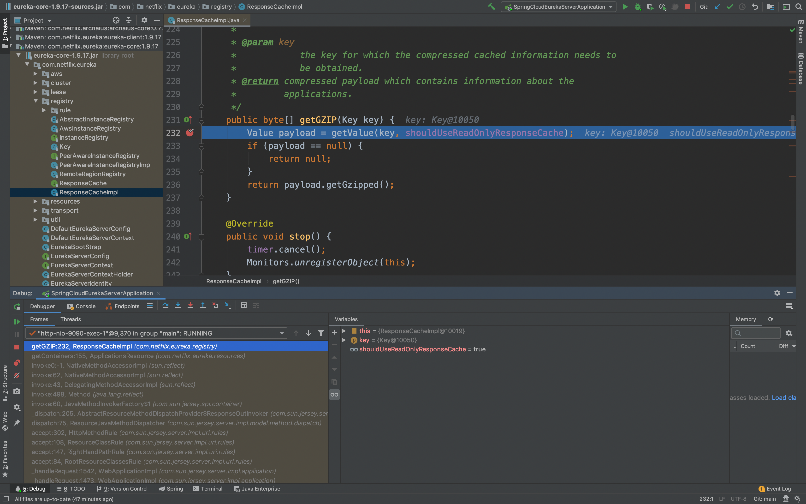
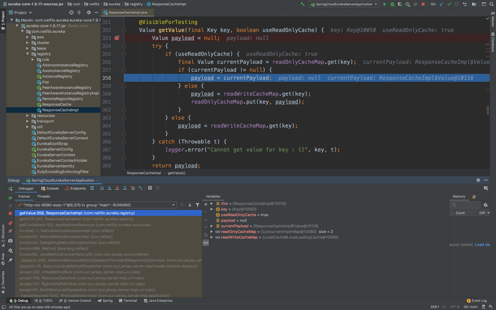

## eureka-server
### 服务注册
- 1.ApplicationResource.addInstance()

- 2.PeerAwareInstanceRegistryImpl.register()

- 3.AbstractInstanceRegistry.register()

- 4.AbstractInstanceRegistry.register()，服务注册保存到本地内存，即变量registry

- 5.AbstractInstanceRegistry.register()，清除缓存

- 6.AbstractInstanceRegistry.invalidateCache()

- 7.ResponseCacheImpl.invalidate()

- 8.ResponseCacheImpl.invalidate()，readWriteCacheMap用的是guava的LoadingCache

### 三级缓存的失效与更新
- 1-1.AbstractInstanceRegistry.EvictionTask.run()，每隔60s，清理超过90s未续约的节点

- 1-2.AbstractInstanceRegistry.evict()，遍历服务实例是否过期

- 1-3.AbstractInstanceRegistry.evict()

- 1-4.AbstractInstanceRegistry.internalCancel()，删除过期的服务实例，即删除变量registry对应节点

- 1-5.AbstractInstanceRegistry.internalCancel()，清除缓存，同上

***
- 2.ResponseCacheImpl.getCacheUpdateTask().new TimerTask.run()，每隔30s，将readWriteCacheMap同步到readOnlyCacheMap

### 服务同步
- 1.PeerAwareInstanceRegistryImpl.register()

- 2.PeerAwareInstanceRegistryImpl.replicateToPeers()，服务同步，遍历集群节点

- 3.PeerAwareInstanceRegistryImpl.replicateInstanceActionsToPeers()

### 服务查询
- 1.ApplicationsResource.getContainers()

- 2.ResponseCacheImpl.getGZIP()

- 3.ResponseCacheImpl.getValue()，从缓存中获取数据

